### Hey, I'm Robert 👋

I do stuff. Mostly backend, automation and tooling, from Romania. Building [Chronic](https://chronic.ro) · Blog: [bert.ro](https://bert.ro)

        

<picture><source srcset="profile/stats-dark.svg" media="(prefers-color-scheme: dark)" /></picture>
<picture><source srcset="profile/top-langs-dark.svg" media="(prefers-color-scheme: dark)" /></picture>

